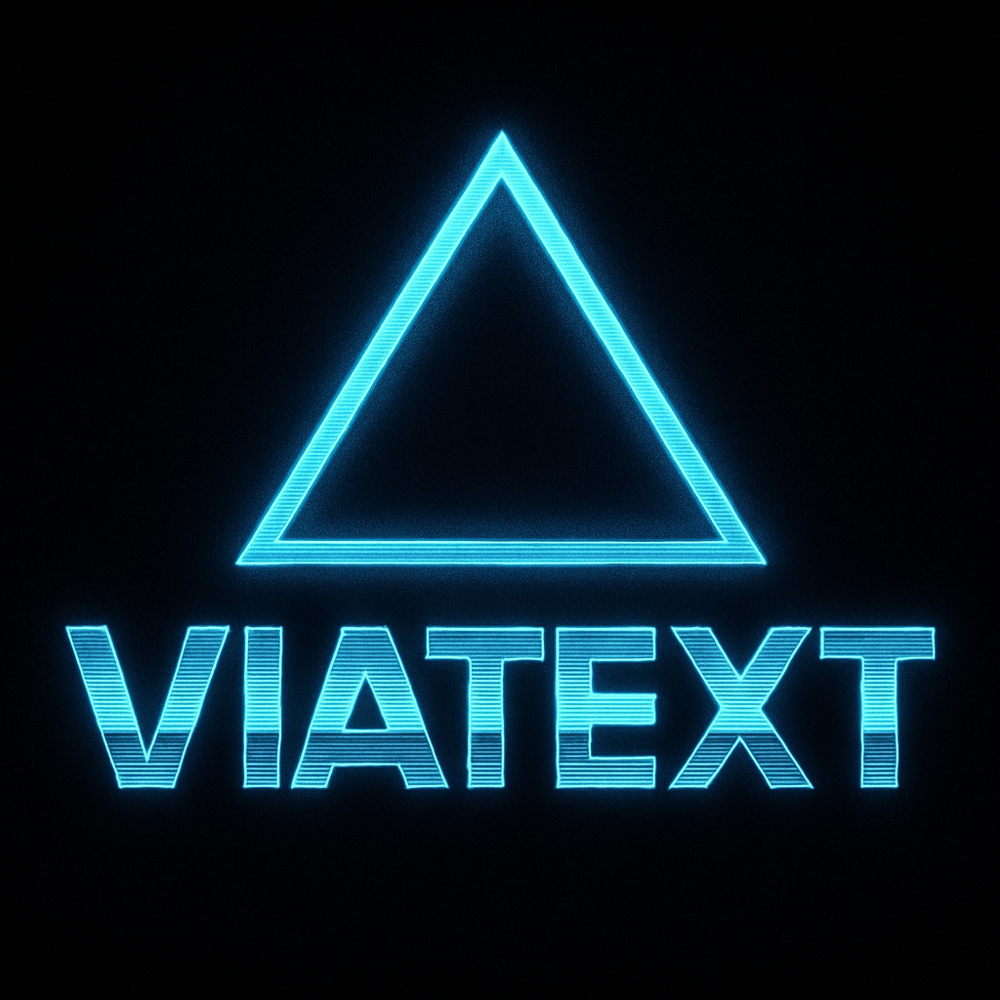

# ViaText Core (Linux)

IN DEVELOPMENT, DO NOT USE

ViaText is an **off-grid, Linux-first messaging system** developed under the [AltGrid](https://github.com/AltGrid) project family.  

It effectively adds human or IoT messaging to an offline computer, provided recipients are running the same system. 

This repository provides the **Linux CLI tools and core libraries** that communicate with [ViaText TTGO LoRa32 nodes](https://github.com/AltGrid/viatext-ttgo-lora32-v21).  

Together, these components form a **plaintext-based protocol** for resilient communication without reliance on phones or cloud infrastructure.  
- **ViaText Core**: manages communication from Linux hosts  
- **ViaText Node**: ESP32-based LoRa device (field hardware)

⚠️ **Note**: This repo alone will not work without nodes. The Linux core is designed to be paired with ViaText LoRa32 devices.

> Build like it’s 1986. Communicate like it’s 2086.  
> **Simplicity · Portability · Autonomy**

---

## Features

- **Simplicity**  
  - Human-readable TLV protocol (no Protobuf, no JSON required)  
  - SLIP framing for robust serial transport  
  - Error strings are short and script-friendly (e.g., `status=error reason=bad_value:sf(7..12)`)  

- **Portability**  
  - Runs on any Linux system: laptops, Raspberry Pi, thin clients  
  - Single Makefile build system (`make`, `make run`, etc.)  
  - Minimal dependencies (C++17 + CLI11 only)  

- **Autonomy**  
  - No phone required, unlike similar systems.  
  - No cloud dependency — works in basement, field, or mountaintop  
  - Nodes can be messaged, scanned, and addressed directly from Linux  
  - Registry + symlink helpers provide stable device paths  

---

## Core Components

- **command_dispatch** — Maps CLI options into protocol packets, with validation.  
- **commands** — Builds TLV requests and decodes responses into shell-friendly lines.  
- **serial_io** — Raw POSIX serial I/O with SLIP framing.  
- **node_registry** — Scans for nodes, probes IDs, saves registry, creates symlinks.  
- **main.cpp (CLI)** — Parses flags, builds request, sends via serial, prints response.  

---

## Architecture

```
+------------------+       Serial/USB       +-------------------+
|  ViaText Core    |  <------------------>  |   ViaText Node    |
|  (Linux CLI)     |   SLIP-framed TLVs     |  (ESP32 + LoRa)   |
|                  |                        |                   |
|  command_dispatch|                        |  node_interface   |
|  commands        |                        |  node_protocol    |
|  serial_io       |                        |  node_display     |
+------------------+                        +-------------------+
```

---

## Typical CLI Usage

After building (`make`), you can run the CLI tool directly:

### Scan and list nodes
```bash
./viatext-cli --scan
```

Output:
```
id=N3 dev=/dev/ttyACM0 online=1
id=N20 dev=/dev/ttyACM2 online=1
```

With symlinks:
```bash
./viatext-cli --scan --aliases
# creates /run/user/<uid>/viatext/viatext-node-N3
```

### Ping a node
```bash
./viatext-cli --node N3 --ping
status=ok seq=1
```

### Get node ID
```bash
./viatext-cli --node N3 --get id
status=ok seq=1 id=N3
```

### Set alias
```bash
./viatext-cli --node N3 --set alias TestNode
status=ok seq=1
```

### Bulk read
```bash
./viatext-cli --node N3 --get all
status=ok seq=1 id=N3 alias=TestNode freq_hz=915000000 sf=7 ...
```

---

## Build Instructions

### Prerequisites
- Linux system (Debian, Ubuntu, Fedora, Arch)  
- g++ (C++17 or newer)  
- `make`  

Verify:
```bash
g++ --version
make --version
```

### Clone and Build
```bash
git clone https://github.com/AltGrid/viatext-core.git
cd viatext-core
make
```


## Relationship to ViaText Node

- **This repo (`viatext-core`)**: Linux-facing CLI and serial manager.  
- **Node repo (`viatext-ttgo-lora32-v21`)**: ESP32 firmware for TTGO LoRa32 V2.1 boards.  

Together:  
- Core builds requests (packets, SLIP frames)  
- Node executes them (radio config, ID, diagnostics)  
- Core decodes responses and presents clean shell-friendly output  

---



## License

MIT License. Written for clarity, portability, and long-term resilience.  
